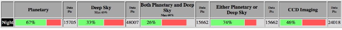
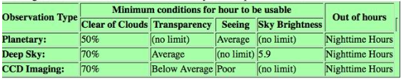

---

layout: page
---

### Climate at the Cosmic Campground IDSS

The CCIDSS has a high percentage of nights which allow visitors one
of the best chances in the world to view the natural night sky.

The data which are in the tables summarizes the distribution of
each different forecast outcome for the Cosmic Campground clear sky
chart from 2005-11-05 to 2017-12-20. These data are a summary of
past forecasts. Even though it's based only on forecasts, some
people use these pages as clue to a site's climate. But climate
data based on actual observation should be preferred (if you can
find it!).

Overall Cosmic Campground IDSS

Key

Percentages are of nighttime hours per month, or per year, when a
particular observing conditions was met. Deep Sky percentages never
exceed 50% because the moon is up half the time. Deep sky percentages
are much lower for charts at high latitudes because of fewer dark
hours in the summer.

