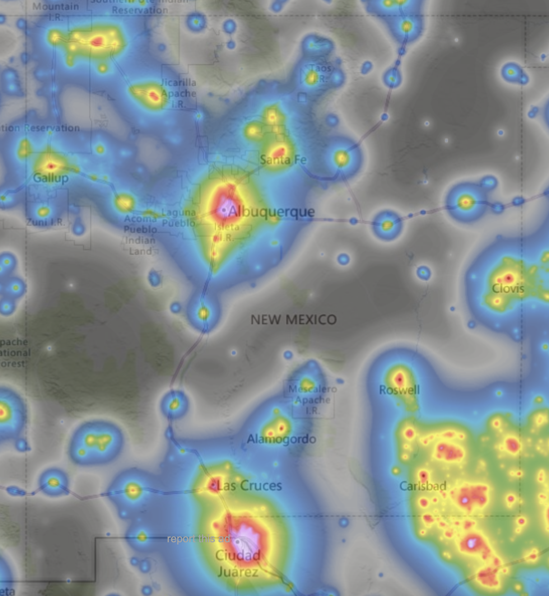

## New Mexico dark sky places

DarkSky International has a formal certification program for 
[DarkSky Places](https://darksky.org/what-we-do/international-dark-sky-places/). There
are currently nine such certified locations in New Mexico:

- Chaco Canyon National Historical Park
- Clayton Lake State Park (DarkSky Park)
- Capulin Volcano National Monument (DarkSky Park)
- [Cosmic Campground (DarkSky Sanctuary)](../cosmic/cosmic) 
- El Morro National Monunment (DarkSky Park)
- Fort Union National Monument (DarkSky Park)
- Salinas Pueblo Missions National Monument (DarkSky Park)
- Valle de Oro Nation Wildlife Refuge (DarkSky Urban Place)
- Valles Caldera National Preserve (DarkSky Park)

 

See [New Mexico True web site](https://www.newmexico.org/darkskies/)

#### NM Chapter goals 

- Manage reporting requirements and activities at [Cosmic Campground](../cosmic/cosmic).

- Establish more designated dark sky places in New Mexico!

  - DarkSky Sanctuary potentional: Magdelena Ridge / Langmuir research state

  - DarkSky Park potential : El Malpais Natl Mon, Pecos Natl Historic Park, City of Rock SP, Leasburg SP, Bottomless Lakes SP, Bluewater SP

  - DarkSky Community potential : Top of the Sky community (near Pietown NM)

#### Resources 

- [types of dark sky places](https://darksky.org/what-we-do/international-dark-sky-places/dark-sky-place-types/)

- [Application process](https://darksky.org/what-we-do/international-dark-sky-places/apply/)

- NM night sky brightness map c. 2015 (from [https://www.lightpollutionmap.info/](https://www.lightpollutionmap.info/)):

- [Interactive map at lighttrends.lightpollutionmap.info](https://lighttrends.lightpollutionmap.info/#zoom=5&lon=-104.56607&lat=34.07112)

- [Gateway to Astronaut Photography of Earth](https://eol.jsc.nasa.gov/)

- [Nighttime lights](https://www.earthdata.nasa.gov/learn/backgrounders/nighttime-lights)

