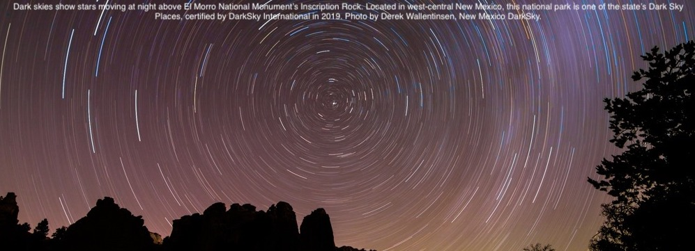
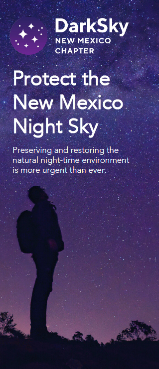

---
# Feel free to add content and custom Front Matter to this file.
# To modify the layout, see https://jekyllrb.com/docs/themes/#overriding-theme-defaults

#layout: home
layout: default
title : New Mexico DarkSky
id : Home
#classes : 
#  - landing
#  - dark-theme
---

 

## Welcome to New Mexico DarkSky

Founded in June 2023, we are a state chapter of [DarkSky International](https://darksky.org).
All members of DarkSky International in the state of New Mexico are chapter members. The
activities of the chapter are managed by the State Council of the organization.

**Vision**:
*New Mexico DarkSky seeks to restore and preserve New Mexico’s
ancestral heritage of majestic, star- filled skies and dark nighttime
environments. We endeavor to eliminate light pollution throughout
the State and protect all communities from its harmful effects,
through advocacy, outreach, education, and conservation.*

**Mission**: <i>The Organization will strive to:
- <i>become the leading force for protecting New Mexico’s existing Dark Sky places and for eliminating light pollution throughout the State.</i>
- <i>develop professional credibility with government, industry, and the public as the authoritative voice for outstanding, protective, and safe outdoor lighting policies.</i>
- <i>bring the experience, expertise, and resources of DarkSky International to enhance and enrich our State-wide work.</i>

**How?** <i>Eliminating light pollution does not mean that we have to
turn all of the lights off. It can be achieved through <b>responsible
lighting</b> that follows some [basic principles](https://darksky.org/resources/guides-and-how-tos/lighting-principles/): use only as much
light as is needed, direct it only to where it is needed, use it
only when it is needed, and use redder light when possible. 

**Why?** <i>Responsible lighting can be safer, save energy and
money, be healthier, have less adverse effect on wildlife, respect
property rights, and enable greater human appreciation and scientific study of the night
sky. Dark skies can also have a positive economic impact through
astrotourism and attracting people to live in New Mexico. There
really is no down side!</i>

[<B>Join</B>](https://darksky.org/ways-to-give/) us by becoming a DarkSky International member!
 [<B>Donate</b>](https://act.darksky.org/newmexicodarksky) directly to the New Mexico chapter!
 [<B>Email</b>](mailto:newmexico@darksky.org) us at <a href="mailto:newmexico@darksky.org"> newmexico@darksky.org
 
[Contact us](mailto:newmexico@darksky.org) to request our Protect the New Mexico DarkSky brochure!

### Initiatives
- [Legislation, ordinances and monitoring](legislation/ordinances)
- [Education, outreach, and community engagement](outreach/education)
- [New Mexico dark sky places](darkskyplaces/nmdarkplaces)
  - [Cosmic Campground DarkSky Sanctuary](cosmic/cosmic)
- [Economic impact and tourism](economicimpact/economic)
- [Ecological/biological impact ](ecological/ecological)
- [December 2023 stakeholder meeting](meeting/meeting)

### Resources
- [DarkSky international](http://darksky.org)
  - [DarkSky approved lighting](https://darksky.org/what-we-do/darksky-approved/)
- [Illuminating Engineering Society](https://www.ies.org/)
- [More external links to information on dark skies](resources/info)
- [Information on ordinances](resources/ordinances)
- [Information on dark-sky friendly products](resources/products)
- [Images of night skies in New Mexico](images)
- [NM presentations](presentations)

### Organization
- [State Council](state_council) 
- [organizational resources](organization)

### Press
- [articles related to NM State Chapter](press/chapter)
- [articles related to dark skies in general](press/other)

 
[Contact us](mailto:newmexico@darksky.org) to request our Protect the New Mexico DarkSky brochure!

