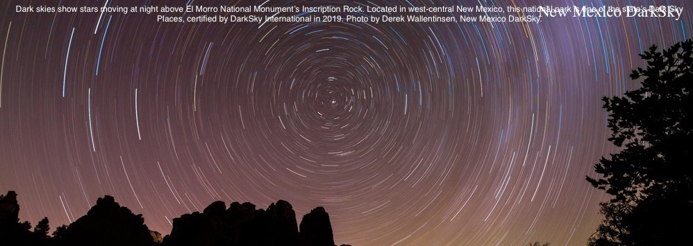

---
# Feel free to add content and custom Front Matter to this file.
# To modify the layout, see https://jekyllrb.com/docs/themes/#overriding-theme-defaults

layout: home
---

 

## Welcome to New Mexico DarkSky

Founded in June 2023, we are a state chapter of [DarkSky International](https://darksky.org).
All members of DarkSky International in the state of New Mexico are chapter members. The
activities of the chapter are managed by the State Council of the organization.

Vision: *To promote stewardship and preservation of the night sky and to protect the 
nighttime environment, communities and wildlife from the harmful effects of light pollution, 
through community engagement, advocacy, and conservation*

[<B>Join</B>](https://darksky.org/ways-to-give/) us by becoming a DarkSky International member!
 [<B>Donate</b>](https://act.darksky.org/newmexicodarksky) directly to the New Mexico chapter!

Organization
- [State Council](state_council) 
- [Bylaws approved 1/24](By-Laws - Approved.pdf) 

[December 2023 stakeholder meeting](meeting/meeting)

Initiatives
- [New Mexico dark sky places](initiatives/nmdarkplaces)
- [Ordinances and monitoring](initiatives/ordinances)
- [Ecological impacts and mitigation](initiatives/ecological)
- [Economic development and tourism](initiatives/economic)
- [Education, outreach, and community engagement](initiatives/education)

Press
- [articles related to NM State Chapter](press/chapter)
- [articles related to dark skies in general](press/other)

Resources
- [DarkSky international](http://darksky.org)
- [Illuminating Engineering Society](https://www.ies.org/)
- [general information on dark skies](resources/info)
- [information on ordinances](resources/ordinances)
- [information on dark-sky friendly products](resources/products)

Organization resources
- [Generic business card](card.pdf)
- [Box drive file location (Box Drive restricted) ](https://app.box.com/folder/197128831422)
- [State members (Box Drive restricted)](https://app.box.com/folder/211347332732)
- [Stakeholders/interested parties (Box Drive restricted)](https://app.box.com/file/1176385402360)
