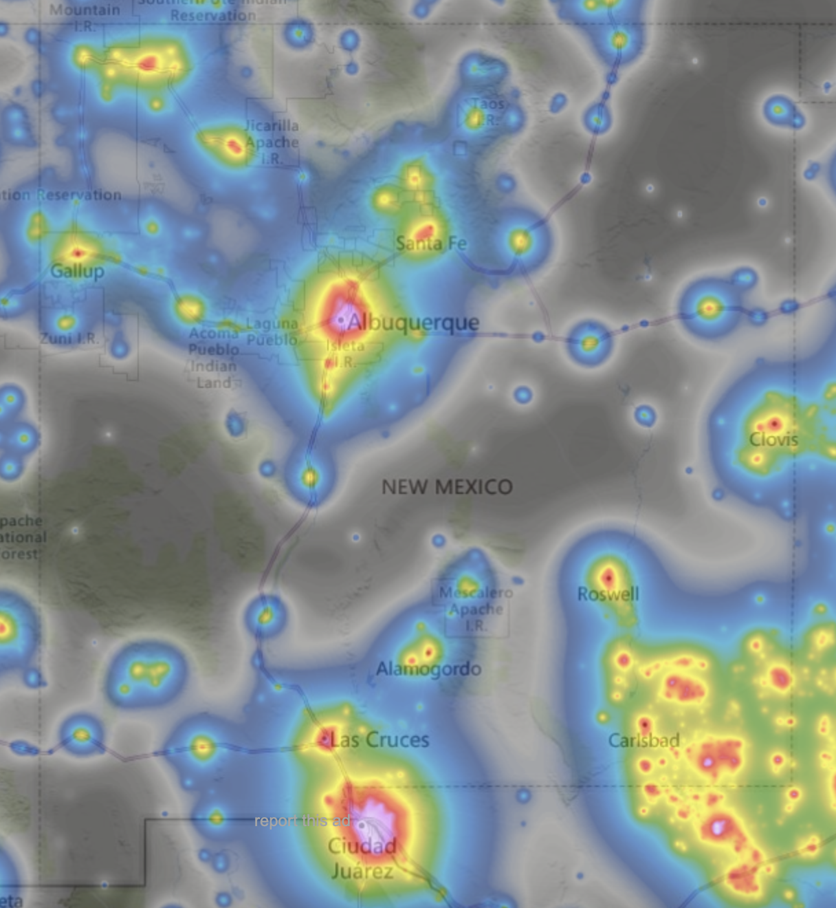
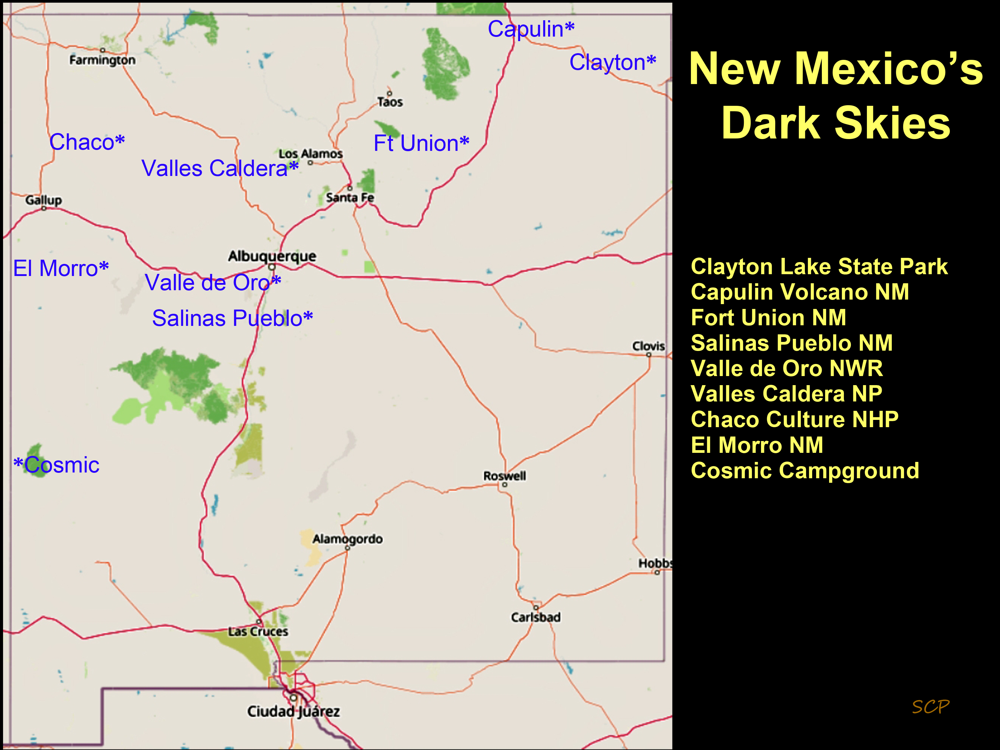

## New Mexico dark sky places

#### Committee

Derek Wallentinsen, Peter Lipscomb,

#### Goals 

Establish more designated dark sky places in New Mexico!

#### Actions 

Dark sky sanctuary potentional: Magdelena Ridge / Langmuir research state

Dark sky park potential : El Malpais Natl Mon, Pecos Natl Historic Park, City of Rock SP, Leasburg SP, Bottomless Lakes SP, Bluewater SP

Dark sky community potential : Top of the Sky community (near Pietown NM)

#### Resources 

[types of dark sky places](https://darksky.org/what-we-do/international-dark-sky-places/dark-sky-place-types/)

[Application process](https://darksky.org/what-we-do/international-dark-sky-places/apply/)

NM night sky brightness map c. 2015 (from [https://www.lightpollutionmap.info/](https://www.lightpollutionmap.info/))
and Declared NM Dark Sky locations (courtesy Derek Wallentinsen):

 

[Interactive map at lighttrends.lightpollutionmap.info](https://lighttrends.lightpollutionmap.info/#zoom=5&lon=-104.56607&lat=34.07112)

[New Mexico True web site](https://www.newmexico.org/darkskies/)
