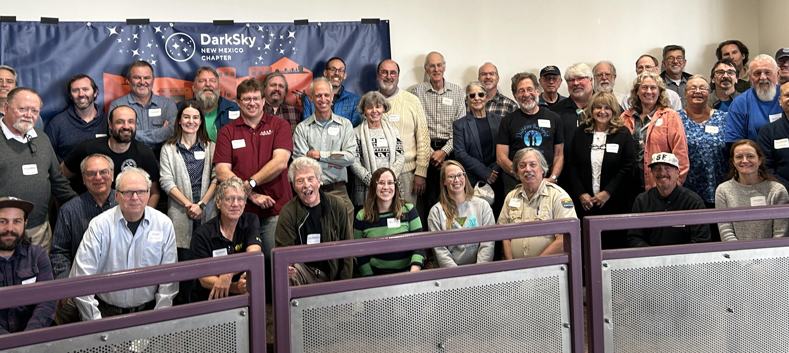

The NM DarkSky chapter, in collaboration with DarkSky International, hosted a 
one-day workshop on December 1, 2023, at New Mexico Tech in Socorro, NM. The
goal was to learn about interests and efforts related to dark skies from around
the state, and to discuss how we can build a broad coalition to work to 
effect change on the issue.

About 60 people attended, mostly in-person, with a few online. 

A [summary of the meeting](Summary.pdf) was subsequently assembled including
some post-meeting feedback from attendees.

#### [Attendees](attendees.html)

#### [Agenda](agenda.html)

#### Presentations
  - [Morning](Morning.pdf)
  - [Afternoon](Afternoon.pdf)
