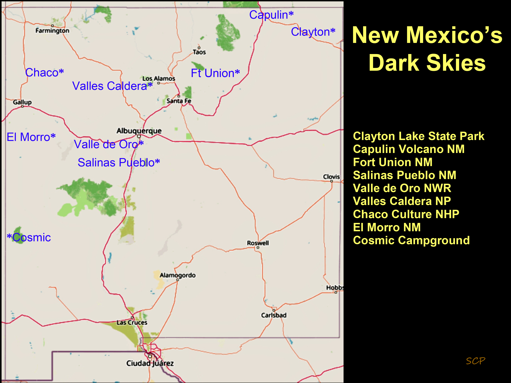

---
# Feel free to add content and custom Front Matter to this file.
# To modify the layout, see https://jekyllrb.com/docs/themes/#overriding-theme-defaults

layout: page
title : New Mexico skies
---

NM night sky brightness map c. 2015 (from [https://www.lightpollutionmap.info/](https://www.lightpollutionmap.info/))
and Declared NM Dark Sky locations (courtesy Derek Wallentinsen):

 

[Interactive map at lighttrends.lightpollutionmap.info](https://lighttrends.lightpollutionmap.info/#zoom=5&lon=-104.56607&lat=34.07112)
