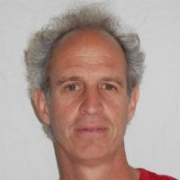
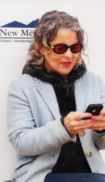
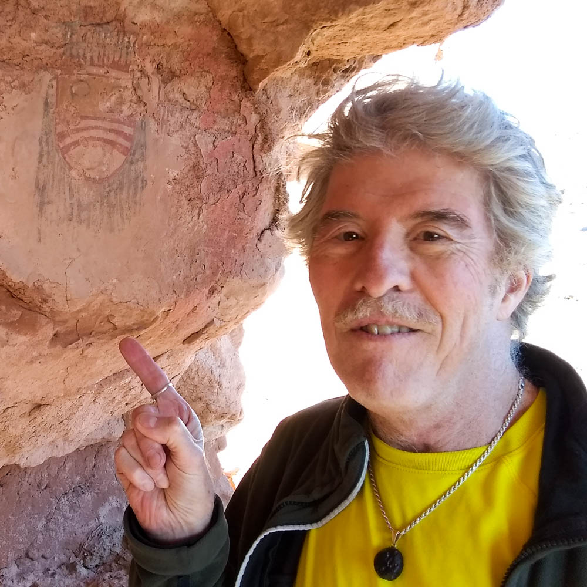

---
# Feel free to add content and custom Front Matter to this file.
# To modify the layout, see https://jekyllrb.com/docs/themes/#overriding-theme-defaults

layout: page
title : State Council
---

**John Briggs**

**Jamey Eriksen**

**Galen Gisler**

**Michael Hensley**

**Jon Holtzman**

{: style="float: left ; width: 20% ; padding: 15px"}
Jon Holtzman is a professional astronomer and educator. He is currently a full 
Professor of Astronomy at New Mexico State University, where he has worked
since 1995. His research interests have led to significant involvement with 
the Hubble Space Telescope and the Sloan Digital Sky Survey. As an educator,
he has taught at both the undergraduate and graduate level. Among other public
outreach efforts, he has run a series of virtual open houses from the 
Tortugas Mountain Observatory outside of Las Cruces.  
As an outdoor enthusiast, he finds respite from looking at the dark nighttime
sky, and wants to ensure that all people have the opportunity to do the same.

**Nick Knorr**

**Marisela La Grave**

{: style="float: left ; width: 20% ; padding: 15px"}
Marisela La Grave (b. Caracas) New York - New Mexico based transmedia artist, director, producer, film maker, photographer and creator of projects that explore the nature of perception, phenomenology, consciousness and temporality. Her multidisciplinary oeuvre includes film, video, sound design, photography, installation & performance art, environmental night sky advocacy, drawing, writing. She produces experimental films, essay style documentaries and time based works for camera that explore the space in between concept, action, archive, reality and auto-fiction. Her cinematic art performance art works, photographs, multidisciplinary site-specific events, sound track design, scripts, works on paper are the core of her existential deracinated ongoing investigations.  M. La Grave  is a  Co-founder and the Artistic director at Magnetic Laboratorium™ (2001) a New York - Paris  based multimedia art studio experimenting with multidisciplinary productions. Her original site-specific collaborative performances for camera with Magnetic Laboratorium associated artists as well as other works have been screened, exhibited, presented, and published internationally and housed in private collections and museums around the world; e.g. The Smith College Museum of Art, Northampton, (Massachusetts) - The Whitney Museum of American Art, Live Series (New York) - Paris Underground Film Festival, (Paris) - The Watermill Center (South Hampton, NY) -  Art Miami Basel Video Lounge, (Miami)  – Hamptons International Film Festival (New York) - Scotiabank Nuit Blanche in (Toronto) –  Dance Theater Workshop, Movement Research, (New York) – Dance Space Saint Marks church New York, NY – PS1-22 (New York) - 98 Bowery Gallery (New York) Museo de Bellas Artes & Museo Jacobo Borges (Caracas) - Nikki Dianne Marquardt Gallery (Paris) - Camera Austria (Vienna) Photographies Magazine, Paris - Vis-à-vis Magazine, Paris Magazine Photo (Paris) - Extra-camera (Caracas) among others. Grants and awarded residencies  include: The Watermill Center, Robert Wilson, (South Hampton, NY) (2014) - Performance Matters, (London) (2010) The Banff Center - New Media (Canada) (2009) - New York Foundation for the Arts (New York) (2008) - Magdalena Ridge Observatory (New Mexico) (2014)- Mount Tremper Arts & Zen Mountain Monastery, (Mount Tremper) NY (2000).   
La Grave studied Film at Tisch School, New York University (New York) - Université Sorbonne Nouvelle Sorbonne 3, (Paris) Photography at the International Center of Photography, (New York). She is currently focused on developing, directing and producing Dark Sky Land, an Experimental documentary Film & Environmental Project based in New Mexico. She is currently responsible for communication design, outreach advocacy campaign strategies for the Dark Sky New Mexico Chapter. 

**Peter Lipscomb**

**Amalio Madueño**

**Gary Starkweather**

**Sheila Sullivan**

**Derek Wallentinsen**  

{: style="float: left ; width: 20% ; padding: 15px"}
Derek Wallentinsen is an independent educator who has been deeply involved in
astronomy outreach and dark skies preservation throughout his life. He is a NASA
JPL Solar System Ambassador, NASA ASP Eclipse Ambassador and AUI Astronomy
in Chile Educator Ambassador, sharing astronomy knowledge with broadly diverse
groups of the public. He has lived in NM since 1958 and has been active in private
and public dark-sky vocations. An early activist for dark skies, Derek drafted a
night-sky friendly municipal lighting ordinance in the 1970s. During his time as a
National Park Service ranger, Derek was instrumental in the certification of
several national parks as International Dark Sky Parks (including Dinosaur
National Monument and El Morro National Monument) and was the recipient of
three STAR awards. He currently is an AstroVIP at several national parks,
monitoring their dark skies and creating various outreach programs and videos.
He formerly worked at the telescope company Celestron and originated the
company’s online knowledgebase.  
Wallentinsen has a Master of Science degree in Astrophysics. In addition to
telescopes, night and day skies, he enjoys desert hiking, geology and birds from
his home base in Albuquerque, New Mexico.  
“I want to see New Mexico’s Dark Sky International chapter broaden out to reach
beyond astronomy to biology, human health and cultural impacts.”

