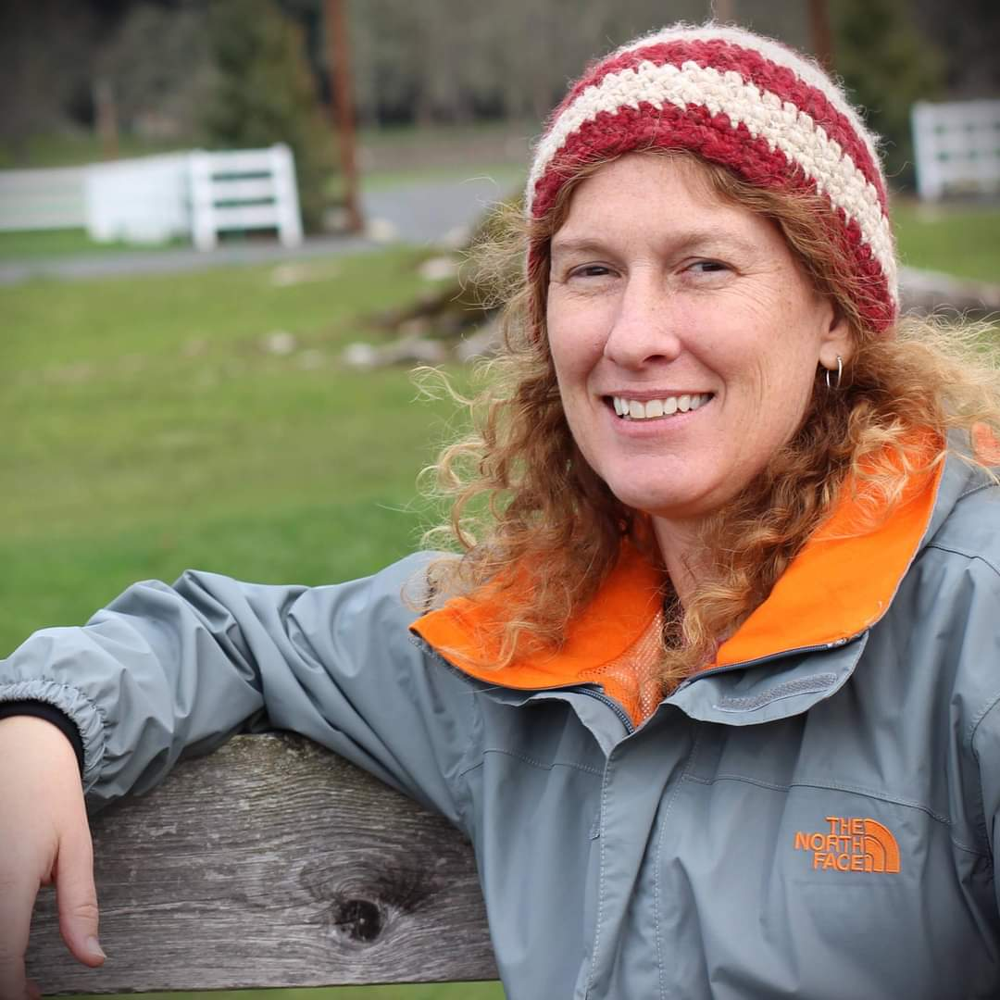
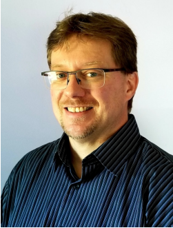
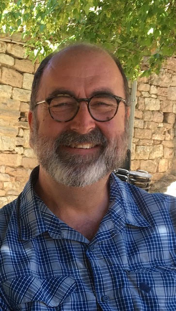

---
# Feel free to add content and custom Front Matter to this file.
# To modify the layout, see https://jekyllrb.com/docs/themes/#overriding-theme-defaults

layout: page
title : State Council
---

The State Council is responsible for the management of the activities
of the chapter. Current (February 2024) members were determined by participation
in the founding of the chapter, but will be elected in subsequent
years. 

Initial/current council consists of : John Briggs, Trish Cutler, Jamey Eriksen,  Galen
Gisler (treasurer), Mark Goodman, Michael Hensley, Jon Holtzman (chair),
Joseph Karnes, Nick Knorr (secretary), Marisela La Grave, Peter Lipscomb (vice chair),
Jim Price, Gary Starkweather, Sheila Sullivan, and Derek Wallentinsen.

Michael Rymer represents Dark Sky International at our Council
meetings.

**John Briggs**

John W. Briggs has lived and worked at far-ranging observatories
in various technical capacities, including Mount Wilson, Yerkes,
National Solar, Maria Mitchell, Venezuelan National, Chamberlin,
Van Vleck, and South Pole Station.  He came to New Mexico with his
family in 1997 to assist in the final commissioning of the Sloan
Digital Sky Survey at Apache Point.  In the 1980s he was an assistant
editor at Sky & Telescope magazine and built Bogsucker Observatory
in Massachusetts.  He is a member of many astronomical organizations
including the Springfield Telescope Makers responsible for the
annual Stellafane Convention in Vermont, and he has served on the
board of the century-old American Association of Variable Star
Observers.  His principal activity now involves the Astronomical
Lyceum, an informal museum, library, laboratory, and lecture hall
devoted to historical astronomy and its preservation, and his role
as secretary of the new Alliance of Historic Observatories.  He is
an adjunct in Physics at NMT in Socorro, and he has participated
in IDA meetings as early as the 1990s.

**Trish Cutler**

{: style="float: left ; width: 20% ; padding: 15px"}
Trish Cutler is a professional wildlife biologist who has worked
in New Mexico (White Sands Missile Range) since 2003. She has a
B.S. degree in Wildlife Science from Oregon State University, and
an M.S. in Wildlife and Fisheries from The University of Arizona.
She has been investigating the impacts of artificial light at night
(ALAN) on nocturnal migrant birds for 10 years. Trish co-chairs the
DoD Partners in Flight Energy and Infrastructure Working Group which
works to address issues like uncontrolled ALAN on military
installations.

Trish has worked to carry out lighting surveys and mitigate
uncontrolled lighting, and through this work she has learned about
the technical aspects of outdoor lighting and lighting codes. She
feels it is critical for the public and public officials to understand
basic lighting concepts such as uplight, backlight, shielding,
glare, and spectrum. With this information it's apparent to most
that we can have the lighting we need without causing unnecessary
sky glow that impacts human health and safety, wildlife, and the
view of our incredible New Mexico night sky.

**Jamey Eriksen**

{: style="float: left ; width: 20% ; padding: 15px"}
Jamey Eriksen is currently working full time as the Director of Operations at Apache Point
Observatory in Sunspot, NM. He has been at APO since 2020, he was previously at Palomar
Observatory in Southern California working for CalTech. At APO he has started to build
connections and meet others working on Astronomy in New Mexico, be it to preserve the great
dark skies we have, or find people to help further public education about work done at APO.
When he is not at work, he and his family explore the US in their RV by visiting National Parks or
Monuments along with any roadside attraction that is discovered along the path.

[long bio](bios/bios#Eriksen)

**Galen Gisler**

Galen Gisler was born under the starry skies of eastern New Mexico
and discovered a passion for astronomy. With a Bachelor’s degree
in physics and astronomy from Yale University and a Ph.D. in
astrophysics from the University of Cambridge, Galen went on to
postdoctoral positions at the Leiden University Observatory and
Kitt Peak National Observatory. He spent two years at the National
Radio Astronomy Observatory, then worked for 25-years at the Los
Alamos National Laboratory and 7 years at the University of Oslo
in Norway, returning to Los Alamos to retire. Galen’s scientific
research has included extragalactic jets, particle beams, plasmas,
astronomical transients, adaptive processing, and hydrocode simulations
of impact processes, tsunamis, and explosive volcanism. In retirement,
he has contributed to astronomy outreach and education, encouraging
people to get outdoors and enjoy the wonders of the night sky.

[long bio](bios/bios#Gisler)

**Mark Goodman**
{: style="float: left ; width: 20% ; padding: 15px"}
Mark Goodman is from Albuquerque and serves as the president of The
Albuquerque Astronomical Society.

**Michael Hensley**

Michael Hensley is a Founder of Dark Sky New Mexico, a remote
telescope hosting facility in Animas NM.  He retired from New Mexico
Tech where he was Director of Strategic Research Initiatives.  As
such, he was responsible for securing major contract funding from
foundations, corporations, and federal agencies.

Hensley was  previously a Professor of Urban Affairs and Planning at
Virginia Tech and served as a White House Community Builder Fellow
during the Clinton Administration.

Hensley is a fourth generation New Mexican and spends his time “…
enjoying the night skies in dark, quiet, and peaceful Animas” as well
as overseeing his  family’s diverse business operations. He obtained
his Ed.D. in technology education from Virginia Tech and did post
doctoral studies at the John F. Kennedy School of Government at
Harvard University.

**Jon Holtzman**

{: style="float: left ; width: 20% ; padding: 15px"}
Jon Holtzman is a professional astronomer and educator. He is currently a full 
Professor of Astronomy at New Mexico State University, where he has worked
since 1995. His research interests have led to significant involvement with 
the Hubble Space Telescope and the Sloan Digital Sky Survey. As an educator,
he has taught at both the undergraduate and graduate level. Among other public
outreach efforts, he has run a series of virtual open houses from the 
Tortugas Mountain Observatory outside of Las Cruces.  
As an outdoor enthusiast, he finds respite from looking at the dark nighttime
sky, and wants to ensure that all people have the opportunity to do the same.

[long bio](bios/bios#Holtzman)

**Joseph Karnes**

**Nick Knorr**

{: style="float: left ; width: 20% ; padding: 15px"}
Nick Knorr is a happily retired banker, living in Santa Fe.  He is
an avid hiker and backpacker.  He believes that connection with the
natural order, which is ever diminishing, is an essential touchstone
of human existence.  That order is nowhere more apparent than in
the night sky to those who are not blinded by light.  He cannot
forget visiting the Hayden Planetarium as a boy and discovering the
vastness of the universe.  Although he abandoned astronomy for other
pursuits, he remains fascinated by the scientific exploration of
the universe through space and time.

**Marisela La Grave**

{: style="float: left ; width: 20% ; padding: 15px"}
Marisela La Grave (b. Caracas) New York - New Mexico based Intermedia
environmental artist, director, producer, film maker, photographer
and creator of collaborative projects that explore the nature of
perception, phenomenology, consciousness and temporality. Her
multidisciplinary oeuvre includes film, video, sound design,
photography, installation & performance art, environmental night
sky advocacy, drawing, writing. She produces experimental films,
essay style documentaries and time based works for camera that
explore the space in between concept, action, archive, reality and
fiction. Her cinematic art performance art works, photographs,
multidisciplinary site-specific events, sound track design, scripts,
works on paper are the core of her existential deracinated ongoing
investigations.  M. La Grave  is a  Co-founder and the Artistic
director at Magnetic Laboratorium™ (2001) a New York - Paris  based
multimedia art lab.  Her original site-specific collaborative
performances for camera with Magnetic Laboratorium associated artists
as well as other media-artworks have been screened, exhibited,
presented, and published internationally and housed in private
collections and museums around the world. She is currently working
on Dark Sky Land, a project related to Night Sky-Wildlife preservation
in New Mexico.

**Peter Lipscomb**

{: style="float: left ; width: 20% ; padding: 15px"}
Peter has been involved in dark sky preservation and education
efforts for two decades. First in 2004, as a volunteer supporting
Chaco Culture National Historical Park and its astronomy program
during a memorable Mars opposition summer. Next as Director of the
New Mexico Heritage Preservation Alliance Night Sky Program (NMHPA)
where he produced the Alliance’s Night Sky Conference at Taos, NM
2007. He actively backed efforts to strengthen enforcement language
in the New Mexico Night Sky Protection Act in 2007 and 2009. Attended
legislative committee meetings, directly engaged with key legislators,
created lobby fliers and information sheets, rallied statewide
contacts for support emails and phone calls to committee members
for upcoming sessions.

He completed five contract cycles with New Mexico State Parks (NMSPD)
as “Reach for the Stars” program contractor, providing public
programs at parks statewide, curriculum development, maintenance
of astronomy equipment and facilities, and training for volunteers
and staff. He authored the nomination packet for designation of
Clayton Lake State Park as New Mexico’s first International Dark-Sky
Park and supported ordinance efforts in Clayton and Union County,
Rio Arriba County, Taos, and Taos County.

In 2002, he founded Astronomy Adventures, a guided night sky tour
business. Over the years, he has shared views of the wonderful and
increasingly rare quality of New Mexico’s dark sky with thousands
of people from across the country and around the world.  He wrote
the weekly Night Skies column for the Santa Fe New Mexican 2007-2010.
In 2016, Peter was honored by the Santa Fe Conservation Trust with
the Stewart Udall award for his night sky activism.  His public
engagement work with the NMHPA, NMSPD, New Mexico Legislature, local
ordinance action, and interpretive education efforts has emphasized
the broad-based importance of the nighttime environment. Its role
as a natural and cultural resource and how it supports biodiversity,
protects cultural heritage, conserves energy production, enhances
our health and safety, bolsters economic benefits of scientific
research and astro-tourism while fulfilling our need for wonder,
awe, serenity, and a universal connectedness to inspire our creativity
and imagination.

In addition to his full-time work with New Mexico State Parks, Peter
is a New Mexico regional team leader for the NASA Earth to Sky
Program, serves as lead tech for Deep Sky West remote observatory
in Rowe, NM, and hosts Sky Railway’s Stargazer train. He is delighted
to have been a part of forming the New Mexico DarkSky chapter.

**Jim Price**

Jim Price is practically a native New Mexican. He has lived in
Albuquerque since most of what is now developed was dirt. Jim worked
for a lighting company and then started his own. He has sold lighting
ranging from miniature lighting for microscopes to parking lot
lighting for every type of business. Jim realized the need for
shielded lighting when shopping malls and other businesses around
Albuquerque with parking lots enlisted him to help them be better
neighbors. He realized then that lighting can be made more comfortable
and effective through proper aiming and shielding. He has adopted
a less is more philosophy with lighting. For example, less glare
means more visual acuity. Less stark contrast means more awareness
of surroundings. He truly believes that taking the “less” approach
leads to “more” satisfying results.

**Gary Starkweather**

{: style="float: left ; width: 20% ; padding: 15px"}
My name is Gary Starkweather and I’m a Dark Sky International (DSI) member and a
council member of New Mexico DarkSky (NMDS). Let me briefly explain why DSI and
NMDS membership is of particular interest to me. After retiring in 2007, I chose to
continue my interest in astronomy and amateur astrophotography as a hobby.  In 2012,
after looking for a place with dark skies, I moved to an astronomy community in Luna
County, New Mexico at New Mexico Astronomy Village (NMAV) near Deming, NM.
NMAV had very dark skies and the State of New Mexico had a Dark Sky Protection Act
which I reasonably believed would protect the naturally dark skies of New Mexico.

In 2015, I moved into a new house at NMAV and by 2023, I completed construction of
three observatories. During the years of construction I realized that I was wrong about
the state’s Dark Sky Protection Act actually protecting the naturally dark skies. The Act
turned out to do virtually nothing to protect the sky. Local counties and towns wouldn’t
enforce the state’s outdoor lighting regulations; they simply ignored the Dark Sky
Protection Act as if it didn’t exist. 

My wife and I invested our life savings moving to New Mexico where we could enjoy
dark skies. We were disappointed because locals were content with ruining the night
skies, and the rate of loss was accelerating. Our story is not unique. There is a large
community of professional and amateur astronomers in New Mexico that are also
watching the rapid destruction of our naturally dark skies. We are looking for ways to
stop the loss of our dark skies and reverse some of the damage that has already
happened. 

Retirement shouldn’t be about spending time protecting retirement investments from
destruction by others, yet, here we are. That is why I have joined the New Mexico
DarkSky team, in hopes that this alliance, along with other like minded, people will be
able to make a difference in protecting naturally dark skies.

**Sheila Sullivan**

{: style="float: left ; width: 20% ; padding: 15px"}
Sheila Sullivan, artist, activist, documentarian. Born and raised
in New Jersey where (oddly enough), nighttime star-gazing was a
family pastime, led by a scientist/uncle who encouraged interest
in all aspects of the natural world.

After a family move to the mid-west, I studied art at Indiana
University and John Heron School of Art, then relocated to San
Francisco and art studies at University of California. Tumultuous
times in San Francisco drew me into activism, first as a SNCC
(Student Nonviolent Coordinating Committee) worker, then as community
activist and documentarian, working to counter societal inequities,
while filming social/civic breakdown/confrontation/upheaval. Following
a move to the mid-west, documentary filming gave way to expression
through “Protest Art”, and more activism.

A move to the Colorado mountains and brilliant dark skies, then
finally to New Mexico, brought me home to Santa Fe and the arts
community. With fellow artists, we were founding members of the
Orchestra of Santa Fe, (forerunner of the Santa Fe Symphony), and
Advocates for Contemporary Arts - promoting and supporting contemporary
art, and celebrating the arts with creation of the annual Beaux
Arts Ball. I was a recipient of “A Gift of Time”, the Donald Anderson
“Roswell Artist-in-Residence”, grant program. My works are in
private, public, corporate collections and museums. I returned to
documentary film work with several years on the “Honoring Our Elders”
film project of the Picuris/Peñasco Community Coalition.

In early years, as assistant director of the city’s first contemporary
art gallery, and over the decades, I began to notice our beautiful,
small-town, dark night sky atmosphere gradually giving way to
over-lighting and the eventual loss of connection to place that a
dark night sky brings. After lobbying for, and passage of, The New
Mexico Night Sky Protection Act”, I created and established “The
New Mexico Night Sky Office” dedicated to bringing awareness,
education, ordinance development and preservation of New Mexico’s
night sky. My program ran for a number of years, which brings me
to the present and the first year of our work establishing the New
Mexico Chapter of DarkSky International.

**Derek Wallentinsen**  

{: style="float: left ; width: 20% ; padding: 15px"}
Derek Wallentinsen is an independent educator who has been deeply involved in
astronomy outreach and dark skies preservation throughout his life. He is a NASA
JPL Solar System Ambassador, NASA ASP Eclipse Ambassador and AUI Astronomy
in Chile Educator Ambassador, sharing astronomy knowledge with broadly diverse
groups of the public. He has lived in NM since 1958 and has been active in private
and public dark-sky vocations. An early activist for dark skies, Derek drafted a
night-sky friendly municipal lighting ordinance in the 1970s. During his time as a
National Park Service ranger, Derek was instrumental in the certification of
several national parks as International Dark Sky Parks (including Dinosaur
National Monument and El Morro National Monument) and was the recipient of
three STAR awards. He currently is an AstroVIP at several national parks,
monitoring their dark skies and creating various outreach programs and videos.
He formerly worked at the telescope company Celestron and originated the
company’s online knowledgebase.  
Wallentinsen has a Master of Science degree in Astrophysics. In addition to
telescopes, night and day skies, he enjoys desert hiking, geology and birds from
his home base in Albuquerque, New Mexico.  
“I want to see New Mexico’s Dark Sky International chapter broaden out to reach
beyond astronomy to biology, human health and cultural impacts.”

